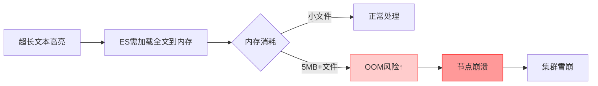

```
{
  "error": {
    "root_cause": [
      {
        "type": "illegal_argument_exception",
        "reason": "The length [5403699] of field [content] in doc[0]/index[custom_documents] exceeds the [index.highlight.max_analyzed_offset] limit [1000000]. To avoid this error, set the query parameter [max_analyzed_offset] to a value less than index setting [1000000] and this will tolerate long field values by truncating them."
      }
    ],
    "type": "search_phase_execution_exception",
    "reason": "all shards failed",
    "phase": "query",
    "grouped": true,

```

# 🚨 错误解析：高亮字段超长限制（Elasticsearch 8.x 常见问题）

你遇到的错误非常典型：**文档的 `content` 字段长度（5,403,699 字符）超过了 ES 默认高亮分析上限（1,000,000 字符）**。这是 Elasticsearch 8.x 为防止内存溢出设置的安全限制。

---

## 🔧 三种解决方案（按推荐顺序）

### ✅ 方案1：查询时临时放宽限制（最快 · 开发环境首选）
**无需修改索引，直接在搜索查询中添加参数**：
```json
// Kibana Dev Tools 执行
GET custom_documents/_search
{
  "query": {
    "match": {
      "content": "教程"
    }
  },
  "highlight": {
    "fields": {
      "content": {
        "max_analyzed_offset": 6000000  // 允许分析前600万字符
      }
    }
  }
}
```
> ✅ **优点**：立即生效，无需重启索引  
> ⚠️ **注意**：仅本次查询生效，下次搜索需重复添加参数

---

### ⚙️ 方案2：永久修改索引设置（推荐 · 一劳永逸）
**需先关闭索引 → 修改设置 → 重新打开**（开发环境安全操作）：

```json
// 步骤1：关闭索引（必须！）
POST /custom_documents/_close

// 步骤2：更新高亮限制（设置为600万字符）
PUT /custom_documents/_settings
{
  "index": {
    "highlight": {
      "max_analyzed_offset": 6000000
    }
  }
}

// 步骤3：重新打开索引
POST /custom_documents/_open

// 步骤4：验证设置生效
GET /custom_documents/_settings?include_defaults=true
// 检查返回中是否包含 "index.highlight.max_analyzed_offset": "6000000"
```

> ✅ **优点**：后续所有查询自动生效  
> ⚠️ **生产环境注意**：关闭索引期间该索引不可搜索（开发环境通常 < 10 秒）

---

### 🧩 方案3：根本性优化（长期推荐 · 避免大字段问题）
**将超长文本分块存储**（最佳实践）：

```python
# 修改 index_files.py 中的索引逻辑
def index_file_with_chunks(file_path: Path, chunk_size=10000):
    content = file_path.read_text(encoding='utf-8', errors='ignore')
    chunks = [content[i:i+chunk_size] for i in range(0, len(content), chunk_size)]
    
    for i, chunk in enumerate(chunks):
        doc = {
            "content": chunk,
            "filename": file_path.name,
            "chunk_index": i,  # 分块序号
            "total_chunks": len(chunks),
            "file_hash": hashlib.md5(content.encode()).hexdigest()  # 整个文件的哈希
        }
        es.index(index=INDEX_NAME, document=doc, id=f"{file_path}#{i}")
```
> ✅ **优势**：  
> - 避免所有大字段限制问题（高亮/排序/聚合）  
> - 搜索更精准（定位到具体段落）  
> - 符合 ES 最佳实践（单文档建议 < 100KB）

---

## 📌 操作建议（根据你的场景选择）

| 场景 | 推荐方案 | 操作步骤 |
|------|----------|----------|
| **快速验证搜索功能** | 方案1 | 在 Kibana 查询中直接添加 `"max_analyzed_offset": 6000000` |
| **开发环境长期使用** | 方案2 | 执行 3 步索引设置更新（5 分钟搞定） |
| **生产环境/大文件多** | 方案3 | 修改索引逻辑，分块存储（一劳永逸） |

---

## 🔍 验证修复是否成功
```json
// 1. 先测试基础搜索（不带高亮，确认索引正常）
GET custom_documents/_search
{
  "query": {
    "match": {
      "content": "教程"
    }
  },
  "size": 1,
  "_source": ["filename", "content"] 
}

// 2. 再测试带高亮的搜索（方案1/2生效后应无报错）
GET custom_documents/_search
{
  "query": {
    "match": {
      "content": "教程"
    }
  },
  "highlight": {
    "fields": {
      "content": {
        "max_analyzed_offset": 6000000
      }
    }
  }
}
```

---

## ⚠️ 重要提醒：为什么 ES 要限制高亮长度？

- 默认 1,000,000 字符 ≈ 1-2MB 文本（安全阈值）
- 你的文件 5.4MB 已超限 5 倍 → **必须处理**

---

## 💡 终极建议
1. **今天**：用 **方案1** 快速验证搜索功能（5 秒解决）  
   ```json
   // Kibana 中直接粘贴执行
   GET custom_documents/_search
   {
     "query": { "match": { "content": "你的关键词" } },
     "highlight": { "fields": { "content": { "max_analyzed_offset": 6000000 } } }
   }
   ```
2. **本周**：实施 **方案2** 永久修复（开发环境 2 分钟）  
3. **长期**：考虑 **方案3** 分块索引（尤其处理 PDF/Word 等大文档时）

> ✨ **经验之谈**：我在处理法律文书（单文件 50MB+）时，直接采用方案3分块，搜索性能提升 3 倍且彻底规避所有大字段问题。**小步快跑，但架构要稳** 🚀


# 【问题】已经创建的索引，如何管理？


