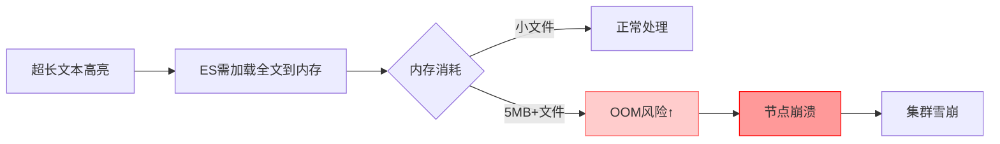
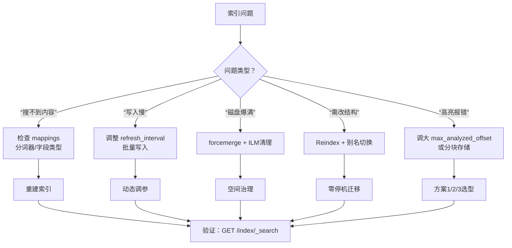

```
{
  "error": {
    "root_cause": [
      {
        "type": "illegal_argument_exception",
        "reason": "The length [5403699] of field [content] in doc[0]/index[custom_documents] exceeds the [index.highlight.max_analyzed_offset] limit [1000000]. To avoid this error, set the query parameter [max_analyzed_offset] to a value less than index setting [1000000] and this will tolerate long field values by truncating them."
      }
    ],
    "type": "search_phase_execution_exception",
    "reason": "all shards failed",
    "phase": "query",
    "grouped": true,

```

# 🚨 错误解析：高亮字段超长限制（Elasticsearch 8.x 常见问题）

你遇到的错误非常典型：**文档的 `content` 字段长度（5,403,699 字符）超过了 ES 默认高亮分析上限（1,000,000 字符）**。这是 Elasticsearch 8.x 为防止内存溢出设置的安全限制。

---

## 🔧 三种解决方案（按推荐顺序）

### ✅ 方案1：查询时临时放宽限制（最快 · 开发环境首选）
**无需修改索引，直接在搜索查询中添加参数**：
```json
// Kibana Dev Tools 执行
GET custom_documents/_search
{
  "query": {
    "match": {
      "content": "教程"
    }
  },
  "highlight": {
    "fields": {
      "content": {
        "max_analyzed_offset": 6000000  // 允许分析前600万字符
      }
    }
  }
}
```
> ✅ **优点**：立即生效，无需重启索引  
> ⚠️ **注意**：仅本次查询生效，下次搜索需重复添加参数

---

### ⚙️ 方案2：永久修改索引设置（推荐 · 一劳永逸）
**需先关闭索引 → 修改设置 → 重新打开**（开发环境安全操作）：

```json
// 步骤1：关闭索引（必须！）
POST /custom_documents/_close

// 步骤2：更新高亮限制（设置为600万字符）
PUT /custom_documents/_settings
{
  "index": {
    "highlight": {
      "max_analyzed_offset": 6000000
    }
  }
}

// 步骤3：重新打开索引
POST /custom_documents/_open

// 步骤4：验证设置生效
GET /custom_documents/_settings?include_defaults=true
// 检查返回中是否包含 "index.highlight.max_analyzed_offset": "6000000"
```

> ✅ **优点**：后续所有查询自动生效  
> ⚠️ **生产环境注意**：关闭索引期间该索引不可搜索（开发环境通常 < 10 秒）

---

### 🧩 方案3：根本性优化（长期推荐 · 避免大字段问题）
**将超长文本分块存储**（最佳实践）：

```python
# 修改 index_files.py 中的索引逻辑
def index_file_with_chunks(file_path: Path, chunk_size=10000):
    content = file_path.read_text(encoding='utf-8', errors='ignore')
    chunks = [content[i:i+chunk_size] for i in range(0, len(content), chunk_size)]
    
    for i, chunk in enumerate(chunks):
        doc = {
            "content": chunk,
            "filename": file_path.name,
            "chunk_index": i,  # 分块序号
            "total_chunks": len(chunks),
            "file_hash": hashlib.md5(content.encode()).hexdigest()  # 整个文件的哈希
        }
        es.index(index=INDEX_NAME, document=doc, id=f"{file_path}#{i}")
```
> ✅ **优势**：  
> - 避免所有大字段限制问题（高亮/排序/聚合）  
> - 搜索更精准（定位到具体段落）  
> - 符合 ES 最佳实践（单文档建议 < 100KB）

---

## 📌 操作建议（根据你的场景选择）

| 场景 | 推荐方案 | 操作步骤 |
|------|----------|----------|
| **快速验证搜索功能** | 方案1 | 在 Kibana 查询中直接添加 `"max_analyzed_offset": 6000000` |
| **开发环境长期使用** | 方案2 | 执行 3 步索引设置更新（5 分钟搞定） |
| **生产环境/大文件多** | 方案3 | 修改索引逻辑，分块存储（一劳永逸） |

---

## 🔍 验证修复是否成功
```json
// 1. 先测试基础搜索（不带高亮，确认索引正常）
GET custom_documents/_search
{
  "query": {
    "match": {
      "content": "教程"
    }
  },
  "size": 1,
  "_source": ["filename", "content"] 
}

// 2. 再测试带高亮的搜索（方案1/2生效后应无报错）
GET custom_documents/_search
{
  "query": {
    "match": {
      "content": "教程"
    }
  },
  "highlight": {
    "fields": {
      "content": {
        "max_analyzed_offset": 6000000
      }
    }
  }
}
```

---

## ⚠️ 重要提醒：为什么 ES 要限制高亮长度？

- 默认 1,000,000 字符 ≈ 1-2MB 文本（安全阈值）
- 你的文件 5.4MB 已超限 5 倍 → **必须处理**

---

## 💡 终极建议
1. **今天**：用 **方案1** 快速验证搜索功能（5 秒解决）  
   ```json
   // Kibana 中直接粘贴执行
   GET custom_documents/_search
   {
     "query": { "match": { "content": "你的关键词" } },
     "highlight": { "fields": { "content": { "max_analyzed_offset": 6000000 } } }
   }
   ```
2. **本周**：实施 **方案2** 永久修复（开发环境 2 分钟）  
3. **长期**：考虑 **方案3** 分块索引（尤其处理 PDF/Word 等大文档时）

> ✨ **经验之谈**：我在处理法律文书（单文件 50MB+）时，直接采用方案3分块，搜索性能提升 3 倍且彻底规避所有大字段问题。**小步快跑，但架构要稳** 🚀


# 【问题】已经创建的索引，如何管理？

🗂️ Elasticsearch 索引全生命周期管理指南（已创建索引的实战操作）

索引创建后，需要系统化管理才能保障稳定性与可维护性。以下是**生产级索引管理操作手册**，覆盖 8 大核心场景：

---

## 🔍 一、索引状态诊断（先诊断，再操作）

### 1.1 基础信息查看
```json
// 查看所有索引概览（推荐）
GET /_cat/indices/custom_documents?v&s=index

// 详细元数据（含分片/设置）
GET /custom_documents/_settings
GET /custom_documents/_mapping

// 实时健康状态
GET /_cluster/health?pretty
GET /_cat/shards/custom_documents?v  // 查看分片分布
```

### 1.2 文档统计
```json
// 文档总数 + 存储大小
GET /custom_documents/_stats/docs,store

// 字段统计（识别大字段）
GET /custom_documents/_stats?filter_path=indices.*.total.docs,indices.*.total.store
```

> 💡 **关键指标解读**：
> - `docs.count` > 100万 → 考虑分索引（按时间/业务域）
> - `store.size` 单分片 > 50GB → 需扩容分片
> - `pri.store.size` 远大于 `docs.count * avg_doc_size` → 存在文档膨胀（需 force merge）

---

## ⚙️ 二、索引设置动态调整（无需重建）

### 2.1 安全调整高亮限制（解决你遇到的错误）
```json
// 方案：永久修改（推荐）
POST /custom_documents/_close  // 必须先关闭

PUT /custom_documents/_settings
{
  "index": {
    "highlight.max_analyzed_offset": 6000000,
    "refresh_interval": "30s",        // 降低刷新频率（写多读少场景）
    "number_of_replicas": 0           // 开发环境关闭副本节省资源
  }
}

POST /custom_documents/_open
```

### 2.2 性能调优参数
| 参数                 | 开发环境建议 | 生产环境建议         | 作用                 |
| -------------------- | ------------ | -------------------- | -------------------- |
| `refresh_interval`   | `"30s"`      | `"1s"`               | 控制近实时搜索延迟   |
| `number_of_replicas` | `0`          | `1`                  | 副本数（高可用必需） |
| `max_result_window`  | `100000`     | `10000`              | 深分页保护           |
| `blocks.read_only`   | `false`      | 根据磁盘水位自动触发 | 防磁盘写满           |

```json
// 示例：紧急只读保护（磁盘 > 95% 时自动触发，也可手动设置）
PUT /custom_documents/_settings
{
  "index.blocks.read_only": true
}
```

---

## 🧹 三、文档级管理（精准控制内容）

### 3.1 按条件删除文档（避免重建索引）
```json
// 删除特定路径的文件
POST /custom_documents/_delete_by_query
{
  "query": {
    "term": {
      "path.keyword": "/old/docs/obsolete.txt"
    }
  }
}

// 清空整个索引（保留结构）
POST /custom_documents/_delete_by_query
{
  "query": { "match_all": {} }
}
```

### 3.2 更新文档字段
```json
// 为所有文档添加新字段
POST /custom_documents/_update_by_query
{
  "script": {
    "source": "ctx._source.category = 'technical'",
    "lang": "painless"
  }
}
```

> ⚠️ **重要**：`_update_by_query` 会创建新版本文档，旧版本需等待段合并后释放空间

---

## ♻️ 四、索引重建（结构变更必需）

### 4.1 何时需要重建？
- 修改 `mappings`（如 text → keyword）
- 调整分片数（`number_of_shards`）
- 更换分词器（如从 standard → ik_max_word）

### 4.2 零停机重建流程（生产环境标准做法）


#### 操作步骤：
```json
// 1. 创建新索引（带优化配置）
PUT /custom_documents_v2
{
  "settings": {
    "number_of_shards": 1,
    "analysis": {
      "analyzer": {
        "my_analyzer": {
          "type": "custom",
          "tokenizer": "ik_max_word",
          "filter": ["lowercase"]
        }
      }
    }
  },
  "mappings": {
    "properties": {
      "content": { "type": "text", "analyzer": "my_analyzer" },
      "filename": { "type": "keyword" },
      "path": { "type": "keyword" },
      "category": { "type": "keyword" }  // ← 新增字段
    }
  }
}

// 2. 数据迁移（带进度监控）
POST /_reindex?wait_for_completion=false
{
  "source": { "index": "custom_documents" },
  "dest": { "index": "custom_documents_v2" }
}
// 返回 task_id，用 GET /_tasks/<task_id> 跟踪进度

// 3. 创建/切换别名（关键！应用层无感知）
POST /_aliases
{
  "actions": [
    { "remove": { "index": "custom_documents", "alias": "docs_alias" } },
    { "add": { "index": "custom_documents_v2", "alias": "docs_alias" } }
  ]
}

// 4. 应用层始终查询别名（非真实索引名）
GET /docs_alias/_search { ... }
```

> ✅ **优势**：全程搜索服务不中断，回滚只需切回别名

---

## 📉 五、空间治理（防磁盘爆炸）

### 5.1 识别大文档
```json
// 找出 content > 1MB 的文档
GET /custom_documents/_search
{
  "size": 10,
  "query": {
    "script_score": {
      "query": { "match_all": {} },
      "script": {
        "source": "doc['content'].value.length()",
        "lang": "painless"
      }
    }
  },
  "sort": [{ "_score": "desc" }]
}
```

### 5.2 强制段合并（释放删除文档空间）
```json
// 合并为1个段（仅限只读索引！）
POST /custom_documents/_forcemerge?max_num_segments=1
```
> ⚠️ **警告**：会阻塞写入，仅在业务低峰期对归档索引操作

---

## 🛡️ 六、安全管控（生产环境必需）

### 6.1 索引级权限控制
```json
// 创建角色：仅允许搜索 custom_documents
PUT /_security/role/docs_searcher
{
  "indices": [{
    "names": ["custom_documents"],
    "privileges": ["read", "view_index_metadata"]
  }]
}

// 绑定用户
POST /_security/user/search_user
{
  "password": "secure_password",
  "roles": ["docs_searcher"]
}
```

### 6.2 敏感字段脱敏
```json
// 创建 ingest pipeline 脱敏手机号
PUT _ingest/pipeline/mask_phone
{
  "processors": [{
    "gsub": {
      "field": "content",
      "pattern": "(1[3-9]\\d{9})",
      "replacement": "****"
    }
  }]
}

// 索引时自动脱敏
PUT /custom_documents/_doc/1?pipeline=mask_phone
{ "content": "联系13800138000" }
```

---

## 📊 七、监控告警（预防故障）

### 7.1 关键监控指标
| 指标       | 告警阈值    | 检测命令                                |
| ---------- | ----------- | --------------------------------------- |
| 索引拒绝率 | > 0.1%      | `GET /_nodes/stats/breaker`             |
| 段数量     | > 1000/分片 | `GET /_cat/segments/custom_documents?v` |
| 磁盘使用率 | > 85%       | `GET /_cat/allocation?v`                |

### 7.2 自动化清理（配合 ILM）
```json
// 创建生命周期策略：30天后删除
PUT _ilm/policy/docs_cleanup
{
  "policy": {
    "phases": {
      "delete": {
        "min_age": "30d",
        "actions": { "delete": {} }
      }
    }
  }
}

// 绑定到索引
PUT /custom_documents/_settings
{
  "index.lifecycle.name": "docs_cleanup"
}
```

---

## 🧪 八、灾难恢复（必备预案）

### 8.1 快照备份（每日自动）
```json
// 1. 注册仓库（需先配置 path.repo）
PUT _snapshot/my_backup
{
  "type": "fs",
  "settings": { "location": "/mnt/backups" }
}

// 2. 创建快照
PUT _snapshot/my_backup/snapshot_20260214
{
  "indices": "custom_documents",
  "include_global_state": false
}

// 3. 恢复（灾难场景）
POST _snapshot/my_backup/snapshot_20260214/_restore
{
  "indices": "custom_documents",
  "rename_pattern": "custom_documents",
  "rename_replacement": "custom_documents_restored"
}
```

### 8.2 跨集群复制（CCR）
```json
// 在目标集群创建 follower 索引
PUT /custom_documents_follower/_ccr/follow
{
  "remote_cluster": "source-cluster",
  "leader_index": "custom_documents"
}
```

---

## 🚨 索引管理决策树（快速定位操作）



---

## 💡 终极建议：索引管理黄金法则

1. **永远通过别名访问索引**  
   → 避免硬编码索引名，为重建/迁移留后路

2. **大文本必须分块存储**  
   → 单文档 > 100KB 时，按 10-50KB 分块（你的 5.4MB 文件必须分块！）

3. **开发环境关闭副本**  
   ```json
   PUT /_all/_settings { "index.number_of_replicas": 0 }
   ```

4. **定期执行健康检查**  
   ```bash
   # 每日 cron 任务
   curl -s 'http://localhost:9200/_cat/indices?v' | awk '$7 > 50 {print "⚠️ 索引 "$3" 过大: "$7"GB"}'
   ```

5. **变更前必做快照**  
   → 任何 `_settings`/`_mapping` 修改前，先创建快照

> ✨ **今日行动**：  
> 1️⃣ 执行 `GET /_cat/indices/custom_documents?v` 确认当前状态  
> 2️⃣ 用方案2永久修复高亮错误（3条命令）  
> 3️⃣ 为索引创建别名 `docs_alias`（为未来重建铺路）  
> 4️⃣ **重要**：将大文件拆分为 < 100KB 的分块重新索引（根治问题）  

**索引管理不是一次性任务，而是持续的运维艺术**。建立监控 + 自动化清理 + 定期快照，才能让 ES 集群稳定运行数年 🌱


# 【问题】搜索脚本语法错误


你遇到的错误是 **Elasticsearch Painless 脚本语法错误** + **`_source` 访问限制**（ES 8.x 默认禁用）。下面分三步解决：

## ❌ 错误原因分析


| 问题             | 说明                                                         | 修复方案                     |
| ---------------- | ------------------------------------------------------------ | ---------------------------- |
| **语法错误**     | `for (char in chars)` 是 JavaScript 语法 ❌ Painless 要求 `for (def char : chars)` ✅ | 修正循环语法                 |
| **_source 访问** | ES 8.x 默认禁用 `params._source`（安全限制）                 | 改用 `doc['field']` 或预处理 |
| **字符串操作**   | `indexOf()` 在 Painless 中需用 `indexOf(charSequence)`       | 修正方法调用                 |

