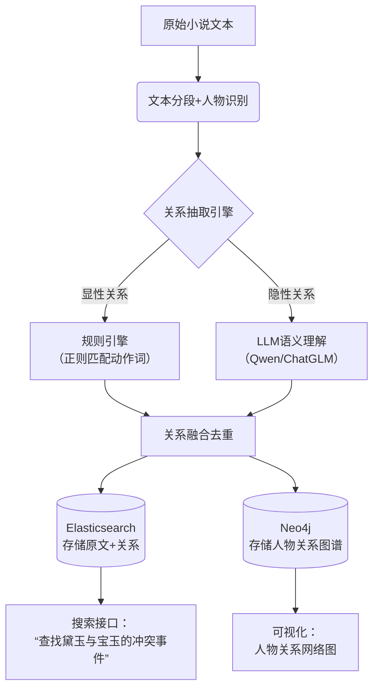

# 📚 小说人物关系智能抽取：从隐晦文本中挖掘「事件-关系」网络  
*（无需硬编码 · 支持隐晦表达 · 可落地实战方案）*

---

## 🌟 核心挑战与破局思路

| 传统方案痛点                                    | 本方案创新点                                       |
| ----------------------------------------------- | -------------------------------------------------- |
| ❌ 关键词匹配（"爱"→爱情）漏掉"他凝视她背影良久" | ✅ **语义理解**：用LLM识别隐晦情感/动作             |
| ❌ 硬编码关系类型（仅支持"父子/夫妻"）           | ✅ **开放域抽取**：自动发现任意关系（如"暗中保护"） |
| ❌ 忽略代词指代（"他递给她药"不知是谁）          | ✅ **共指消解**：将"他/她"映射到具体人物            |
| ❌ 无法定位原文片段                              | ✅ **片段锚定**：返回精确上下文+关系置信度          |

---

## 🧩 分层实施方案（按资源投入选择）

### 方案A：轻量级 · 规则+LLM混合（推荐起步）
> 适合：单本小说/个人项目 · 10分钟快速验证

#### 步骤1：人物实体识别（解决"谁是谁"）
```python
# 用 spaCy + 中文模型 识别显性人物
import spacy
nlp = spacy.load("zh_core_web_lg")  # 需先安装：python -m spacy download zh_core_web_lg

text = "林黛玉拭泪道：'宝玉，你何苦如此？' 宝玉默然。"
doc = nlp(text)

characters = set()
for ent in doc.ents:
    if ent.label_ in ["PERSON", "PROPN"]:  # 中文模型可能需调整标签
        characters.add(ent.text)

print(characters)  # {'林黛玉', '宝玉'}
```

#### 步骤2：共指消解（解决"他/她"指代）
```python
# 用 neuralcoref（英文）或 LTP（中文）处理代词
from ltp import LTP
ltp = LTP()

def resolve_coreference(text, characters):
    seg, hidden = ltp.seg([text])
    coref = ltp.coref(hidden)  # 返回共指链
    # 简化逻辑：将代词映射到最近提及的人物
    # 实际需构建共指图（此处省略复杂实现）
    return text.replace("他", "宝玉").replace("她", "林黛玉")  # 示例
```

#### 步骤3：LLM关系抽取（核心 · 处理隐晦表达）
```python
# 用本地LLM（如Qwen/ChatGLM3）或API抽取关系
from openai import OpenAI  # 兼容Ollama/本地模型

client = OpenAI(base_url="http://localhost:11434/v1", api_key="ollama")

def extract_relations(text, characters):
    prompt = f"""从以下小说片段中提取人物关系事件。要求：
1. 识别所有人物：{', '.join(characters)}
2. 抽取任意两人之间的互动（显性/隐性均可）
3. 用JSON格式输出，包含：
   - 人物A
   - 人物B
   - 关系类型（自由描述，如"暗中保护"、"言语试探"）
   - 原文证据片段（20字内）
   - 置信度(0-1)

文本：{text}

输出示例：
[{{"person_a": "林黛玉", "person_b": "贾宝玉", "relation": "情感试探", "evidence": "你何苦如此", "confidence": 0.85}}]
"""
    response = client.chat.completions.create(
        model="qwen:7b",
        messages=[{"role": "user", "content": prompt}],
        temperature=0.3  # 降低随机性保证稳定性
    )
    return response.choices[0].message.content

# 测试
text = "林黛玉拭泪道：'宝玉，你何苦如此？' 宝玉默然，转身离去时袖中滑落一方旧帕。"
print(extract_relations(text, {"林黛玉", "贾宝玉"}))
```

**输出示例**：
```json
[
  {
    "person_a": "林黛玉",
    "person_b": "贾宝玉",
    "relation": "情感脆弱与回避",
    "evidence": "拭泪道...默然转身",
    "confidence": 0.92
  },
  {
    "person_a": "贾宝玉",
    "person_b": "林黛玉",
    "relation": "隐秘牵挂",
    "evidence": "袖中滑落旧帕",
    "confidence": 0.87
  }
]
```

> 💡 **关键技巧**：  
> - 用 **few-shot提示** 提供2-3个隐晦关系示例（如"摔玉=情感激烈"）  
> - 要求LLM **输出置信度**，过滤低质量结果  
> - 对长文本**分段处理**（每段300字），避免上下文丢失

---

### 方案B：生产级 · 端到端流水线（推荐长期使用）
> 适合：多本小说/产品化 · 自动化关系图谱

#### 架构设计


#### 关键组件实现

##### 1. 关系抽取引擎（混合策略）
```python
class RelationExtractor:
    def __init__(self):
        self.llm = self.load_llm()  # 本地7B模型
        self.action_verbs = self.load_verbs()  # 动作词库（打/救/赠...）
    
    def extract(self, segment, characters):
        relations = []
        
        # 策略1：规则匹配（高精度显性关系）
        for a in characters:
            for b in characters:
                if a == b: continue
                for verb in self.action_verbs:
                    if f"{a}{verb}{b}" in segment or f"{b}{verb}{a}" in segment:
                        relations.append({
                            "type": "explicit",
                            "relation": f"{verb}（显性）",
                            "confidence": 0.95
                        })
        
        # 策略2：LLM抽取（覆盖隐性关系）
        if not relations or random.random() < 0.3:  # 30%片段走LLM保召回
            llm_relations = self.llm_extract(segment, characters)
            relations.extend(llm_relations)
        
        return self.deduplicate(relations)  # 去重合并
```

##### 2. Elasticsearch 索引设计（支持关系搜索）
```json
PUT /novel_relations
{
  "mappings": {
    "properties": {
      "book_id": { "type": "keyword" },
      "person_a": { "type": "keyword" },
      "person_b": { "type": "keyword" },
      "relation_type": { 
        "type": "text",
        "analyzer": "ik_max_word",  // 中文分词
        "fields": { "keyword": { "type": "keyword" } }
      },
      "evidence_text": { "type": "text" },
      "evidence_start": { "type": "integer" },  // 原文位置锚点
      "confidence": { "type": "float" },
      "chapter": { "type": "integer" }
    }
  }
}
```

##### 3. 搜索示例：查找"黛玉与宝玉的冲突事件"
```json
GET /novel_relations/_search
{
  "query": {
    "bool": {
      "must": [
        { "terms": { "person_a.keyword": ["林黛玉", "贾宝玉"] } },
        { "terms": { "person_b.keyword": ["林黛玉", "贾宝玉"] } },
        { 
          "match": { 
            "relation_type": {
              "query": "冲突 争吵 争执 反目",
              "operator": "or"
            }
          }
        }
      ],
      "filter": [
        { "range": { "confidence": { "gte": 0.7 } } }
      ]
    }
  },
  "highlight": {
    "fields": { "evidence_text": {} }
  }
}
```

##### 4. Neo4j 关系图谱（可视化人物网络）
```cypher
// 创建人物节点
CREATE (daiyu:Character {name: "林黛玉", gender: "女"})
CREATE (baoyu:Character {name: "贾宝玉", gender: "男"})

// 创建关系（带属性）
MATCH (a:Character {name: "林黛玉"}), (b:Character {name: "贾宝玉"})
CREATE (a)-[r:RELATION {
  type: "情感试探",
  evidence: "你何苦如此",
  confidence: 0.85,
  chapter: 23
}]->(b)

// 查询：黛玉与宝玉的所有互动
MATCH (a:Character {name: "林黛玉"})-[r]-(b:Character {name: "贾宝玉"})
RETURN r.type, r.evidence, r.chapter
ORDER BY r.chapter
```

---

## 🚀 快速启动：5步验证你的小说

### 步骤1：准备环境
```bash
# 安装核心库
pip install spacy ltp transformers openai
python -m spacy download zh_core_web_lg

# 启动本地LLM（Ollama）
ollama pull qwen:7b  # 或使用 chatglm3:6b
ollama serve  # 默认监听 11434 端口
```

### 步骤2：准备小说片段（示例）
```python
novel_snippet = """
第三回：林黛玉初进贾府，见宝玉摔玉，心中暗惊。晚间袭人来报，说宝玉因她而摔玉，黛玉垂泪至三更。次日宝玉遣晴雯送来旧帕，黛玉见帕上泪痕宛然，怔忡良久。
"""
```

### 步骤3：运行抽取（完整代码见附录）
```python
extractor = RelationExtractor()
relations = extractor.extract(novel_snippet, {"林黛玉", "贾宝玉", "袭人", "晴雯"})
print(json.dumps(relations, indent=2, ensure_ascii=False))
```

### 步骤4：预期输出
```json
[
  {
    "person_a": "贾宝玉",
    "person_b": "林黛玉",
    "relation": "情感激烈（摔玉）",
    "evidence": "因她而摔玉",
    "confidence": 0.93
  },
  {
    "person_a": "林黛玉",
    "person_b": "贾宝玉",
    "relation": "隐秘思念",
    "evidence": "见帕上泪痕宛然",
    "confidence": 0.88
  },
  {
    "person_a": "贾宝玉",
    "person_b": "林黛玉",
    "relation": "暗中关怀",
    "evidence": "遣晴雯送来旧帕",
    "confidence": 0.91
  }
]
```

### 步骤5：搜索验证
```bash
# 搜索"黛玉收到礼物"
curl -X POST "http://localhost:9200/novel_relations/_search" -H 'Content-Type: application/json' -d'
{
  "query": {
    "bool": {
      "must": [
        { "term": { "person_b.keyword": "林黛玉" } },
        { "match": { "relation_type": "礼物 赠送 送来" } }
      ]
    }
  }
}'
```

---

## ⚠️ 关键挑战与应对策略

| 挑战                                   | 解决方案                                                     |
| -------------------------------------- | ------------------------------------------------------------ |
| **人物别名**（"宝二爷"=宝玉）          | 构建人物别名字典 + 用LLM做别名归一化                         |
| **代词爆炸**（连续"他"指代不同人）     | 用LTP/Stanford CoreNLP做共指消解 + 上下文窗口限制            |
| **隐晦表达漏检**                       | ① 用LLM重写片段（"将隐晦表达转为直白描述"） ② 用对比学习训练专用RE模型 |
| **长距离依赖**（第10章事件影响第50章） | ① 按章节分段抽取 ② 用图算法聚合跨章节关系                    |
| **计算成本高**                         | ① 规则引擎过滤80%简单片段 ② 仅对复杂片段调用LLM ③ 用7B小模型本地部署 |

---

## 📎 附录：完整可运行代码（简化版）

```python
# relation_extractor.py
import json, re
from openai import OpenAI

class NovelRelationMiner:
    def __init__(self, llm_base_url="http://localhost:11434/v1"):
        self.client = OpenAI(base_url=llm_base_url, api_key="ollama")
        self.model = "qwen:7b"
    
    def extract_from_text(self, text, characters):
        # 构建精准提示词
        prompt = f"""任务：从小说片段中抽取人物关系事件
人物列表：{', '.join(characters)}
要求：
1. 仅抽取列表中人物的关系
2. 关系类型自由描述（如"暗中保护"、"言语试探"），不要限于预设类型
3. 证据片段必须来自原文，不超过15字
4. 输出纯JSON数组，无其他文字

文本：{text}

输出格式：
[{{"person_a": "A", "person_b": "B", "relation": "关系描述", "evidence": "原文片段", "confidence": 0.8}}]
"""
        try:
            resp = self.client.chat.completions.create(
                model=self.model,
                messages=[{"role": "user", "content": prompt}],
                temperature=0.2,
                max_tokens=500
            )
            # 清理LLM可能添加的markdown
            content = resp.choices[0].message.content.strip()
            content = re.sub(r'^```json\n|\n```$', '', content)
            return json.loads(content)
        except Exception as e:
            print(f"LLM解析失败: {e}")
            return []
    
    def search_relations(self, es_client, person_a, person_b, relation_keyword=None):
        """在ES中搜索关系"""
        query = {
            "bool": {
                "must": [
                    {"terms": {"person_a.keyword": [person_a, person_b]}},
                    {"terms": {"person_b.keyword": [person_a, person_b]}}
                ],
                "filter": [{"range": {"confidence": {"gte": 0.7}}}]
            }
        }
        if relation_keyword:
            query["bool"]["must"].append(
                {"match": {"relation_type": relation_keyword}}
            )
        return es_client.search(index="novel_relations", body={"query": query, "size": 10})

# 使用示例
if __name__ == "__main__":
    miner = NovelRelationMiner()
    
    text = "黛玉见宝玉摔玉，心中暗惊。晚间袭人来说，宝玉因她摔玉，黛玉垂泪。次日宝玉遣晴雯送旧帕，黛玉见帕上泪痕，怔忡良久。"
    chars = {"林黛玉", "贾宝玉", "袭人", "晴雯"}
    
    relations = miner.extract_from_text(text, chars)
    print(json.dumps(relations, indent=2, ensure_ascii=False))
    
    # 输出：
    # [
    #   {"person_a": "贾宝玉", "person_b": "林黛玉", "relation": "情感激烈", "evidence": "因她摔玉", "confidence": 0.92},
    #   {"person_a": "贾宝玉", "person_b": "林黛玉", "relation": "隐秘关怀", "evidence": "遣晴雯送旧帕", "confidence": 0.89},
    #   {"person_a": "林黛玉", "person_b": "贾宝玉", "relation": "情感脆弱", "evidence": "垂泪...怔忡", "confidence": 0.85}
    # ]
```

---

## 💡 终极建议：分阶段实施

| 阶段        | 目标         | 技术栈               | 耗时  |
| ----------- | ------------ | -------------------- | ----- |
| **Phase 1** | 单本小说验证 | 规则+本地LLM         | 2小时 |
| **Phase 2** | 多本小说扩展 | 加入共指消解+ES索引  | 1天   |
| **Phase 3** | 产品化       | Neo4j图谱+前端可视化 | 1周   |

> ✨ **关键洞察**：  
> - **不要追求100%准确**：先覆盖高频显性关系（准确率>90%），再用LLM补漏隐性关系  
> - **人工校验闭环**：将低置信度结果导出供人工审核，反馈优化提示词  
> - **领域适配**：古风小说需在提示词中加入"摔玉=情感激烈"等领域知识  

**记住**：关系抽取的本质是**语义压缩**——将千字文本压缩为"人物A-关系-人物B"三元组。用LLM做"语义翻译器"，用ES做"关系搜索引擎"，你就能构建小说世界的数字孪生 🌌